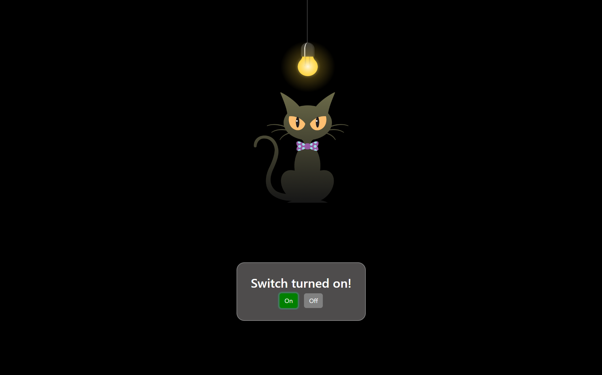

## Cat Light On/Off — JavaScript Mini Project

A fun and simple interactive webpage built with **HTML**, **CSS**, and **JavaScript**, where you can turn a cat’s light **on or off** using buttons.
Perfect for beginners learning DOM manipulation and event handling in JS!

---

###  Project Preview



###  Features

* 🟢 **Light ON/OFF functionality**
* 🐾 **Interactive button controls** using JS event listeners
* 💡 **Dynamic image switching** with smooth transitions
* 🎨 **Responsive layout** styled using **Bootstrap 5**
* ⚙️ Simple and clean folder structure for easy understanding

---

###  Technologies Used

* **HTML5** – structure of the webpage
* **CSS3** – styling and animations
* **Bootstrap 5** – for layout and button styling
* **JavaScript (Vanilla)** – logic for switching light modes

---

###  Folder Structure

```
cat-on-off/
│
├── index.html          # main file
├── style.css           # stylesheet
├── script.js           # JavaScript logic
└── images/
    ├── Light-on.png
    └── Light-off.png
```

---

###  How It Works

* The webpage displays an image of a **light bulb (or cat)**.
* When you click the **ON** button:

  * The image changes to `Light-on.png`
  * The bulb glows with a soft light effect
* When you click the **OFF** button:

  * The image changes to `Light-off.png`
  * The glow disappears

---

###  Setup Instructions

1. **Clone this repository**

   ```bash
   git clone https://github.com/<your-username>/cat-on-off.git
   ```

2. **Open the project folder**

   ```bash
   cd cat-on-off
   ```

3. **Run the project**

   * Simply open `index.html` in your browser
   * Or use a local server extension (like **Live Server** in VS Code)

---

### 🖋️ Code Overview

**HTML:**
Defines the layout, buttons, and image placeholder.

**CSS:**
Handles styling, centering, and optional glow effects using transitions.

**JavaScript:**
Changes the image `src` dynamically and toggles classes for visual effects.

---

###  Future Improvements

* Add sound effects when toggling the light.
* Animate the cat’s eyes or tail movement.
* Use a single button that toggles between ON/OFF automatically.

---

### Contributing

Contributions are welcome!
Feel free to open issues or submit pull requests to enhance the project.

---

### License

This project is open-source and available under the **MIT License**.

---

### Author

**Bittu Gurrala** <br>
📧 gurralasrisai.plac@gmail.com <br>
🔗 Github link: https://github.com/bittugurrala <br>
🔗 LinkedIn link: https://www.linkedin.com/in/srisaigurrala/
